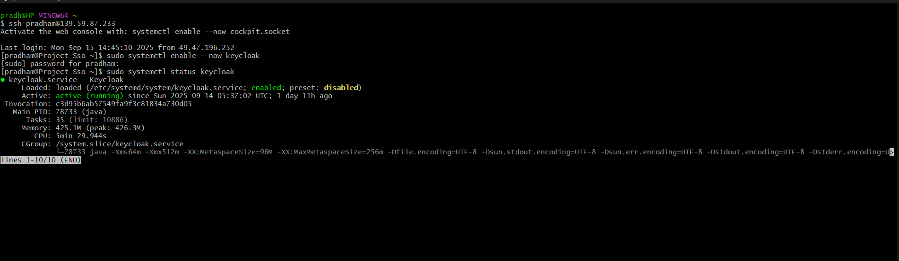
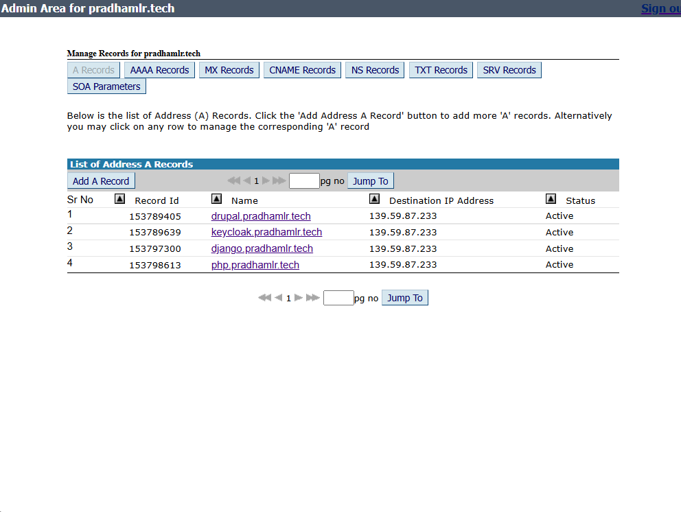

# DigitalOcean Server Setup with Keycloak SSO Integrated with Drupal, Django and Php

## SSO Integration Overview: Drupal, Django, PHP

This deployment demonstrates seamless Single Sign-On (SSO) integration for three major web application stacks using Keycloak:

- **Drupal 11**: Utilizes the Keycloak module for Drupal, enabling users to authenticate via Keycloak. The module is configured in the Drupal admin UI, mapping Keycloak users and roles to Drupal accounts. SSO login and user provisioning are handled automatically, providing a unified authentication experience.

- **Django**: Integrates with Keycloak using the `mozilla-django-oidc` library. Django is configured as an OIDC client, allowing users to log in with their Keycloak credentials. The integration supports secure session management and user mapping, ensuring Django applications benefit from centralized identity management.

- **PHP Application**: Implements SSO using OIDC client libraries for PHP. The application is registered as a client in Keycloak, and authentication flows are managed via OIDC endpoints. Users can log in to the PHP app using their Keycloak accounts, with session and user data synchronized securely.

All integrations are production-ready, leveraging secure OIDC flows, and are validated with screenshots and configuration images throughout this guide.

## How to Use This Repository

This repository provides a step-by-step, production-grade tutorial for deploying a secure DigitalOcean droplet with Keycloak Single Sign-On (SSO) integration for Drupal 11, Django, and a PHP application. Screenshots (in `snippets/`) are embedded at each step, and configuration/service files (in `config/`) are shown as code snippets with links to the full files. Use this guide to reproduce the setup or as a reference for similar SSO deployments.

---

## 1. Introduction & Live URLs

This project demonstrates a professional deployment of Keycloak SSO on a DigitalOcean droplet, integrating SSO with Drupal 11, Django, and a PHP application. The guide covers server hardening, firewall setup, application deployment, and SSO configuration, with all steps validated by screenshots and config files.

| Service           | Live URL                         |
|-------------------|----------------------------------|
| Droplet Public IP | http://139.59.87.233             |
| Drupal 11         | https://drupal.pradhamlr.tech    |
| Django App        | https://django.pradhamlr.tech    |
| PHP App           | https://php.pradhamlr.tech       |

---

## 2. Droplet Creation & Server Hardening

### Create DigitalOcean Droplet

Provision a Rocky Linux 10 droplet with SSH key authentication and IPv6 enabled.


*Droplet creation in DigitalOcean panel*

### Initial Server Hardening

- Add a new sudo user, copy your SSH key, and disable root SSH login.

Add a new sudo user, copy your SSH key, and disable root SSH login as shown in the screenshots.


*SSH hardening and user setup*

---

## 3. Firewall Configuration & Core Packages Installation

### Firewall Setup

Enable and configure the firewall for HTTP, HTTPS, SSH, and Keycloak ports as shown in the screenshots.


*Firewall ports configured for web and Keycloak*

### System Update & Core Packages

Update the system and install all required core packages for web, database, and scripting support as shown in the screenshots.


*Apache, PHP, and MariaDB installed and running*


*MariaDB service status after installation and configuration*

---

## 4. Keycloak Installation, Configuration & Service Setup

### Install Java & Keycloak

Install Java and Keycloak, and set up the Keycloak user and permissions as shown in the screenshots.


*Java and Keycloak downloaded and extracted*

### Keycloak Initial Run & Admin Setup

Start Keycloak in development mode to create the initial admin user.

Access `http://your_droplet_ip:8080` to create the admin user.


*Keycloak admin user creation*

### Keycloak as a Systemd Service

Set up Keycloak as a systemd service using the provided config file ([View full file](config/keycloak-systemd-service.png)).


*Keycloak running as a systemd service*

---

## 5. Drupal 11 Setup & Keycloak SSO Integration

### Database & Drupal Installation

Create the Drupal database, install Drupal, and configure the Apache virtual host as shown in the screenshots and config file ([View full file](config/drupal-apache-vhost.png)).


*Drupal installation via Composer*


*Drupal site home page after installation*


*Drupal admin dashboard interface*

### Keycloak SSO Integration

Install and enable the Keycloak module, then configure it with your Keycloak server and client credentials in the Drupal admin UI.


*Drupal Keycloak module configuration*


*Keycloak client configuration for Drupal SSO*


*Drupal login page with SSO option*


*Redirect to Keycloak for authentication*


*Drupal user profile after SSO login*

---

## 6. Django Project Setup, Gunicorn & Keycloak SSO Integration


*Django application home page*


*Django admin dashboard*

### Database & Django Project Setup

Create the Django database, set up the Django project, and configure the Apache reverse proxy as shown in the screenshots and config file ([View full file](config/django-apache-proxy.png)).
Set up Gunicorn as a systemd service ([View full file](config/gunicorn-service.png)).

### Keycloak SSO Integration (Django)

Install and configure the mozilla-django-oidc library for SSO integration, following the provided config file ([View full file](config/Drupal-Dependencies.png)).


*Django login via Keycloak SSO*


*Django user session after SSO login*

---

## 7. PHP App Setup & Keycloak SSO Integration


*PHP application landing page*


*Keycloak client configuration for PHP SSO*

### PHP App Deployment

Deploy the PHP application, configure the Apache virtual host ([View full file](config/php-apache-vhost.png)), and set up OIDC SSO using the provided scripts.


*PHP app login via Keycloak SSO*


*PHP user profile after SSO login*

---

## 8. Final Notes, Evaluation Criteria & Live Demo Links

- Ensure all services are running and accessible from the public internet.
- All SSO flows should be tested and screenshots included.
- Provide live URLs for evaluation.

| Service           | Live URL                         |
|-------------------|----------------------------------|
| Droplet Public IP | https://139.59.87.233             |
| Drupal 11         | https://drupal.pradhamlr.tech    |
| Django App        | https://django.pradhamlr.tech    |
| PHP App           | https://php.pradhamlr.tech       |

---

## Repository Structure

```text
.
├── README.md
├── snippets/
│   ├── 1-droplet.png
│   ├── ...
│   └── 29-gunicorn-status.png
├── config/
│   ├── drupal-apache-vhost.png
│   ├── django-apache-proxy.png
│   ├── gunicorn-service.png
│   ├── keycloak-systemd-service.png
│   ├── php-apache-vhost.png
│   ├── Drupal-Dependencies.png
│   └── ...
```

---

**End of Guide.**

---

## DNS Configuration

The DNS records for all application domains (Drupal, Django, PHP) and the public IP are configured as shown below. This ensures that each subdomain points to the correct server and supports secure SSO flows.


*DNS records setup for all application domains and SSO integration*
